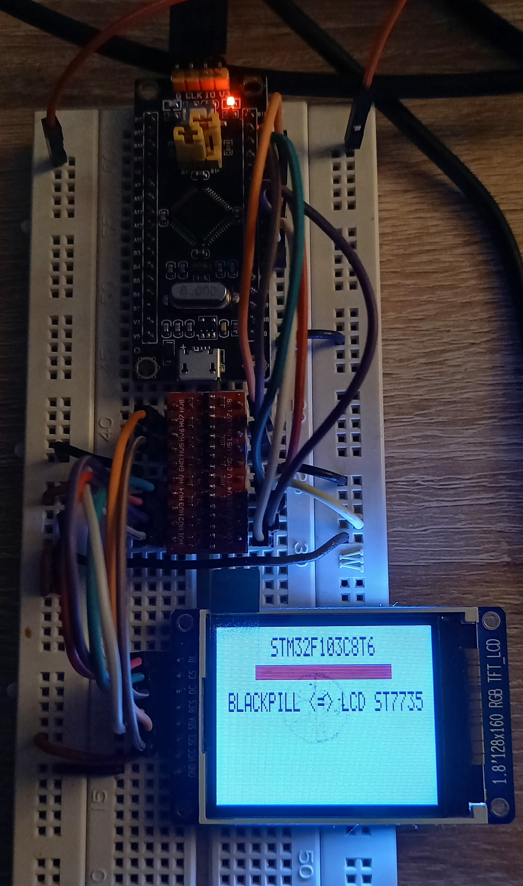

# STM32F103C8T6 <=> 1.8 LCD with ST7735 driver
Neccessary hardware
- Development board - Blackpill (stm32f103c8t6)
- Debugger/programmer ST-Link v2
- 3.3V to 5V converter module (6 pins)
- 1.8 LCD with ST7735 driver
- wires

Library version 1.0 
- communication through SPI1 (without remapping pins)
- software type of slave select management
- working with only one display

## ST7735 Library
Example of SPI1 communication with peripheral LCD display. Detailed information how to drive SPI on microcontroller STM32f103C8T6 is described in [RM0008 Reference manual](https://www.st.com/resource/en/reference_manual/cd00171190-stm32f101xx-stm32f102xx-stm32f103xx-stm32f105xx-and-stm32f107xx-advanced-arm-based-32-bit-mcus-stmicroelectronics.pdf) and information about how to drive LCD with ST7735 driver is described in [ST7735 Manual](http://www.displayfuture.com/Display/datasheet/controller/ST7735.pdf).

## Library
C library is aimed for driving ST7735 1.8 TFT LCD display 162x132 through SPI1's STM32f103C8T6 in master mode. Library uses SPI1 without remapping pins and software type of slave select management PINA4.

### Usage
Prior defined for microcontroller STM32f103C8T6 (Blackpill, Bluepill). 

### Tested
Library was tested and proved on a ST7735 1.8″ TFT display with Blackpill board used STM32f103C8T6.

### Pinout
SPI1 alternate function remapping according to [RM0008 Reference manual](https://www.st.com/resource/en/reference_manual/cd00171190-stm32f101xx-stm32f102xx-stm32f103xx-stm32f105xx-and-stm32f107xx-advanced-arm-based-32-bit-mcus-stmicroelectronics.pdf) (9.3.10, page 181).

The GPIO pins configuration is according to [RM0008 Reference manual](https://www.st.com/resource/en/reference_manual/cd00171190-stm32f101xx-stm32f102xx-stm32f103xx-stm32f105xx-and-stm32f107xx-advanced-arm-based-32-bit-mcus-stmicroelectronics.pdf) (9.1.11, page 167).

| PIN | SPI1 | GPIO Configuration |
| :---: | :---: | :--: |
| SS | PA4 |  Software => General Purpose push-pull |
| SCK | PA5 | Master => Alternate function push-pull |
| MISO | PA6 | Full duplex / master => Input floating / Input pull-up |
| MOSI | PA7 | Full duplex / master => Alternate function push-pull |

### Functions
- [*void* **ST7735_Init** *(SPI_TypeDef *)*]() - initialise SPI1 clock, pins, load essential commands and parameters
- [*void **ST7735_ClearScreen** (uint16_t color)*]() - clear screen with specific color
- [*uint8_t **ST7735_DrawLine** (uint8_t x1, uint8_t x2, uint8_t y1, uint8_t y2, uint16_t color)*]() - draw line
- [*uint8_t **ST7735_DrawChar** (char character, uint16_t color, enum Size)*]() - draw character

  
## Demonstration

## Acknowledgement
- [Erwin Ouyang](http://www.handsonembedded.com/stm32f103-spl-tutorial-5/)
- [Manu NALEPA](https://github.com/nalepae/stm32_tutorial/blob/master/src/spi.c)
- [Learn, build, and share](https://learnbuildshare.wordpress.com/about/stm32/using-spi-as-master/)
- [Adafuit TFT](https://github.com/adafruit/Adafruit-ST7735-Library)
- [AVR TFT](http://w8bh.net/avr/AvrTFT.pdf)

## Links
- [RM0008 Reference manual](https://www.st.com/resource/en/reference_manual/cd00171190-stm32f101xx-stm32f102xx-stm32f103xx-stm32f105xx-and-stm32f107xx-advanced-arm-based-32-bit-mcus-stmicroelectronics.pdf)
- [Datasheet ST7735](http://www.displayfuture.com/Display/datasheet/controller/ST7735.pdf)
